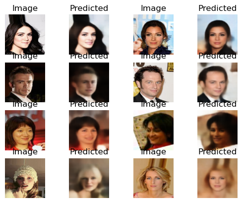
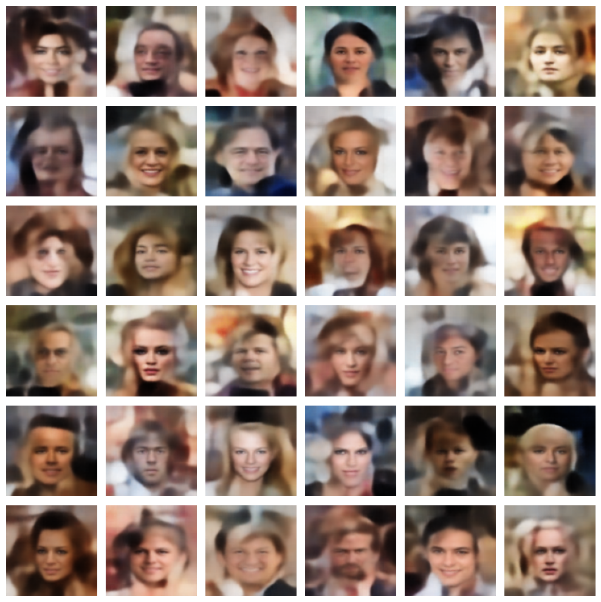
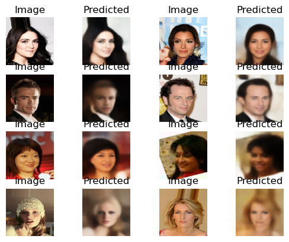
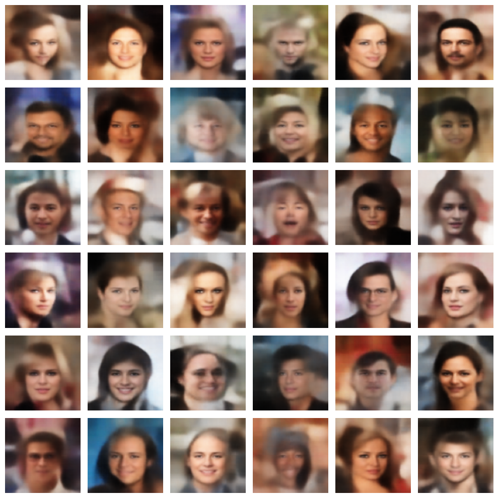
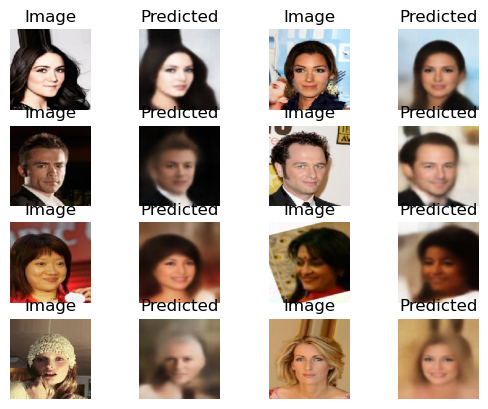
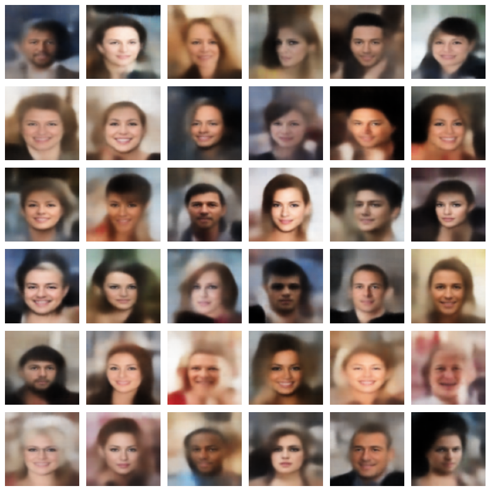
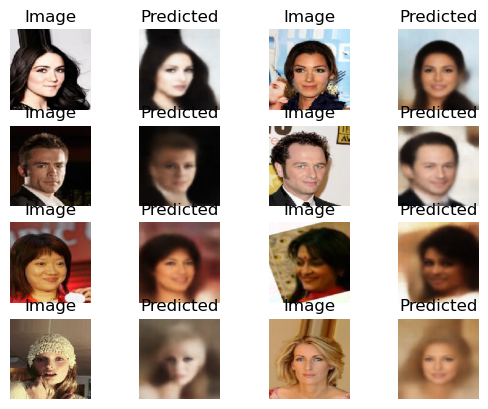
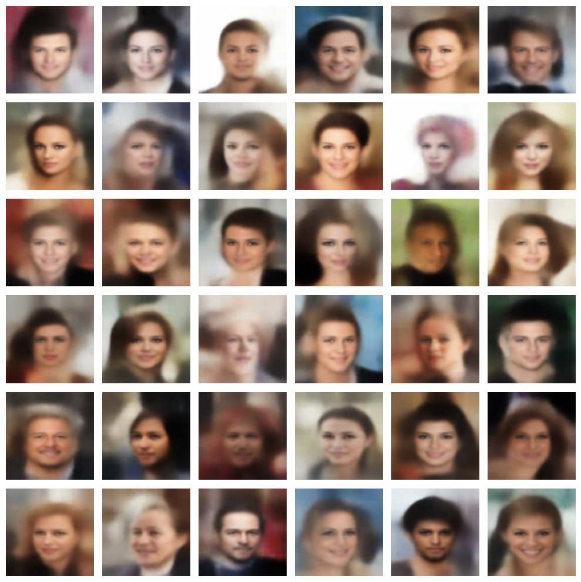

Autoencoder
===========

The module
-----------

.. automodule:: autoencoder
    :members:

The models 
-----------

4 models of autoencoder are saved by default, they all have the same structure, only the ``beta`` parameter corresponding to the weight accorded 
for the ``kl loss`` compared to the ``reconstruction loss``.

The common structure of the variational autoencoder is the following :

Encoder :

+-----------------+---------------------+
|Layer type       |Output shape         |
+-----------------+---------------------+
|InputLayer       |[(None, 128, 128, 3)]|
+-----------------+---------------------+
|Conv2D           |(None, 64, 64, 32)   |
+-----------------+---------------------+
|Conv2D           |(None, 32, 32, 64)   |
+-----------------+---------------------+
|Conv2D           |(None, 16, 16, 128)  |
+-----------------+---------------------+
|Conv2D           |(None, 8, 8, 256)    |
+-----------------+---------------------+
|Flatten          |(None, 16384)        |
+-----------------+---------------------+
|z_mean (Dense)   |(None, 256)          |
+-----------------+---------------------+
|z_log_var (Dense)|(None, 256)          |
+-----------------+---------------------+
|Lambda           |(None, 256)          |
+-----------------+---------------------+

Decoder :

+----------------+---------------------+
|Layer type      |Output shape         |
+----------------+---------------------+
|InputLayer      |(None, 256)          |
+----------------+---------------------+
|Dense           |(None, 16384)        |
+----------------+---------------------+
|Conv2DTranspose |(None, 8, 8, 256)    |
+----------------+---------------------+
|Conv2DTranspose |(None, 16, 16, 256)  |
+----------------+---------------------+
|Conv2DTranspose |(None, 32, 32, 128)  |
+----------------+---------------------+
|Conv2DTranspose |(None, 64, 64, 64)   |
+----------------+---------------------+
|Conv2DTranspose |(None, 128, 128, 32) |
+----------------+---------------------+
|Conv2DTranspose |(None, 128, 128, 3)  |
+----------------+---------------------+

Only the beta parameter is varying between the model, from 1 to 5 (best results). Here some examples of some predictions made with the different 
model using random points in the latent space or from the dataset :

vae_model_NN3_w1
""""""""""""""
beta = 1

Prediction from dataset :

Random point in the latent space :

vae_model_NN3_w2
""""""""""""""""
beta = 2

Prediction from dataset :

Random point in the latent space :

vae_model_NN3_w3
""""""""""""""""
beta = 3

Prediction from dataset :

Random point in the latent space :

vae_model_NN3_w5
""""""""""""""""
beta = 5

Prediction from dataset :

Random point in the latent space :

The Dataset 
-----------

The dataset used for training the variational autoencoders is the CelebA dataset available `here`_.

.. _here: https://mmlab.ie.cuhk.edu.hk/projects/CelebA.html